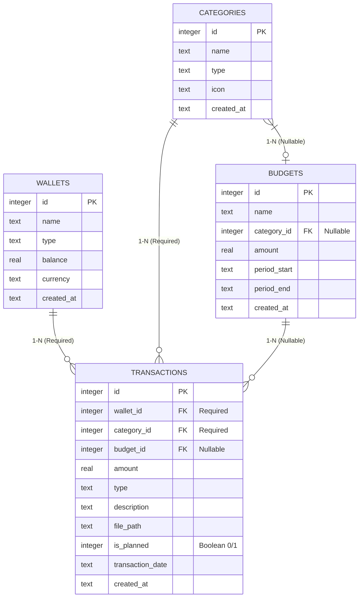

# Reedrich MCP - Database Schema & Relationship Documentation

This document describes the Cloudflare D1 (SQLite) database architecture, schema definitions, relationships, and data modeling for the **Reedrich MCP** server.

---

## 1. Architecture & Tech Choice

- **Database Engine**: Cloudflare D1 (SQLite) with WAL mode.
- **ORM Framework**: Drizzle ORM (`drizzle-orm/d1`).
- **Data Isolation**: Multi-tenant Row-Level Security via `user_id` foreign keys on all primary entities (`wallets`, `categories`, `budgets`, `transactions`, `debts_loans`).
- **Naming Convention**: Table-prefixed column names (`user_...`, `wallet_...`, `category_...`, `budget_...`, `transaction_...`, `debt_loan_...`) with ISO-8601 timestamps.

---

## 2. Entity Relationship Diagram (ERD)

---

## 3. Detailed Table Schemas

### 3.1. `wallets` Table
Represents accounts or physical wallets (e.g. Cash, Bank Accounts, E-Wallets, Credit Cards).

| Column Name | SQLite Data Type | Constraints | Default | Description |
|---|---|---|---|---|
| `id` | `INTEGER` | `PRIMARY KEY AUTOINCREMENT` | - | Unique wallet identifier |
| `name` | `TEXT` | `NOT NULL` | - | Wallet name (e.g., "Cash", "Main Bank", "GoPay") |
| `type` | `TEXT` | `NOT NULL` | `'bank'` | Wallet type (`bank`, `cash`, `e-wallet`, `credit`) |
| `balance` | `REAL` | `NOT NULL` | `0.0` | Current account balance |
| `currency` | `TEXT` | `NOT NULL` | `'IDR'` | Currency code (default: Indonesian Rupiah) |
| `created_at` | `TEXT` | `NOT NULL` | - | ISO-8601 creation timestamp |

---

### 3.2. `categories` Table
Represents classification categories for financial transactions.

| Column Name | SQLite Data Type | Constraints | Default | Description |
|---|---|---|---|---|
| `id` | `INTEGER` | `PRIMARY KEY AUTOINCREMENT` | - | Unique category identifier |
| `name` | `TEXT` | `NOT NULL` | - | Category name (e.g., "Food & Beverage", "Salary") |
| `type` | `TEXT` | `NOT NULL` | `'expense'` | Category type (`expense`, `income`) |
| `icon` | `TEXT` | `NULLABLE` | - | Emoji or icon representation (e.g., 🍔, 🚗, 💰) |
| `created_at` | `TEXT` | `NOT NULL` | - | ISO-8601 creation timestamp |

---

### 3.3. `budgets` Table
Represents spending limits bounded strictly by active date windows (`period_start` to `period_end`).

| Column Name | SQLite Data Type | Constraints | Default | Description |
|---|---|---|---|---|
| `id` | `INTEGER` | `PRIMARY KEY AUTOINCREMENT` | - | Unique budget identifier |
| `name` | `TEXT` | `NOT NULL` | - | Budget name (e.g., "August Grocery Budget") |
| `category_id` | `INTEGER` | `FOREIGN KEY (categories.id) NULLABLE` | `NULL` | Linked category (Optional N-1 relationship) |
| `amount` | `REAL` | `NOT NULL` | - | Target budget limit |
| `period_start` | `TEXT` | `NOT NULL` | - | Start date of active window (YYYY-MM-DD) |
| `period_end` | `TEXT` | `NOT NULL` | - | End date of active window (YYYY-MM-DD) |
| `created_at` | `TEXT` | `NOT NULL` | - | ISO-8601 creation timestamp |

---

### 3.4. `transactions` Table
Represents individual financial transactions (actual spent/received or planned/projected items).

| Column Name | SQLite Data Type | Constraints | Default | Description |
|---|---|---|---|---|
| `id` | `INTEGER` | `PRIMARY KEY AUTOINCREMENT` | - | Unique transaction identifier |
| `wallet_id` | `INTEGER` | `FOREIGN KEY (wallets.id) NOT NULL` | - | Linked wallet ID (1-N Required) |
| `category_id` | `INTEGER` | `FOREIGN KEY (categories.id) NOT NULL` | - | Linked category ID (1-N Required) |
| `budget_id` | `INTEGER` | `FOREIGN KEY (budgets.id) NULLABLE` | `NULL` | Linked budget ID (Auto-linked or explicit) |
| `amount` | `REAL` | `NOT NULL` | - | Transaction amount (positive number) |
| `type` | `TEXT` | `NOT NULL` | `'expense'` | Transaction type (`expense`, `income`, `transfer`) |
| `description` | `TEXT` | `NULLABLE` | `NULL` | Transaction notes or description |
| `file_path` | `TEXT` | `NULLABLE` | `NULL` | Local path to receipt image, PDF, audio, or CSV |
| `is_planned` | `INTEGER` | `NOT NULL` | `0` | Financial planning flag (`0` = Actual, `1` = Planned) |
| `transaction_date` | `TEXT` | `NOT NULL` | - | Date of transaction (YYYY-MM-DD) |
| `created_at` | `TEXT` | `NOT NULL` | - | ISO-8601 creation timestamp |

---

### 3.5. `debts_loans` Table
Represents personal debt (liabilities/payable) and loan (receivable) commitments.

| Column Name | SQLite Data Type | Constraints | Default | Description |
|---|---|---|---|---|
| `debt_loan_id` | `TEXT` | `PRIMARY KEY (UUID)` | `crypto.randomUUID()` | Unique debt/loan identifier |
| `debt_loan_user_id` | `TEXT` | `FOREIGN KEY (users.user_id) ON DELETE CASCADE` | - | Tenant user ID owner |
| `debt_loan_person_name` | `TEXT` | `NOT NULL` | - | Counterparty person or institution name |
| `debt_loan_type` | `TEXT` | `NOT NULL` | `'loan'` | Type (`'debt'` = we owe, `'loan'` = they owe us) |
| `debt_loan_amount` | `REAL` | `NOT NULL` | - | Initial principal amount |
| `debt_loan_remaining_amount` | `REAL` | `NOT NULL` | - | Outstanding unpaid amount |
| `debt_loan_wallet_id` | `TEXT` | `FOREIGN KEY (wallets.wallet_id) ON DELETE SET NULL` | `NULL` | Associated source/destination wallet |
| `debt_loan_due_date` | `TEXT` | `NULLABLE` | `NULL` | Due date string (YYYY-MM-DD or ISO-8601) |
| `debt_loan_status` | `TEXT` | `NOT NULL` | `'unpaid'` | Status (`'unpaid'`, `'partially_paid'`, `'paid'`) |
| `debt_loan_notes` | `TEXT` | `NULLABLE` | `NULL` | Optional notes or description |
| `debt_loan_created_at` | `TEXT` | `NOT NULL` | `CURRENT_TIMESTAMP` | ISO-8601 creation timestamp |

---

## 4. Key Business Logic & Cardinality Rules

1. **Wallet Balance Auto-Update**:
   - When a transaction is recorded with `is_planned = 0`:
     - `type = 'expense'` subtracts `amount` from `wallets.balance`.
     - `type = 'income'` adds `amount` to `wallets.balance`.
   - When `is_planned = 1` (Planned Transaction), the wallet balance remains unchanged.

2. **Active Budget Date Windowing**:
   - Budget utilization is calculated strictly within `period_start` and `period_end`:
     $$\text{period\_start} \le \text{transaction\_date} \le \text{period\_end}$$
   - Transactions recorded outside a budget's active window are excluded from that budget's spending total.

3. **File Attachments (`file_path`)**:
   - Stores local relative or absolute path on disk for receipt images, voice notes, PDFs, or CSV exports.
   - Used by `send_attachment` tool to resend files back to Telegram upon user request.

4. **Default Seeding**:
   - Automatic DDL execution creates tables if not present on startup.
   - Auto-seeds default Cash and Bank wallets, plus 11 standard expense & income categories on first run.
