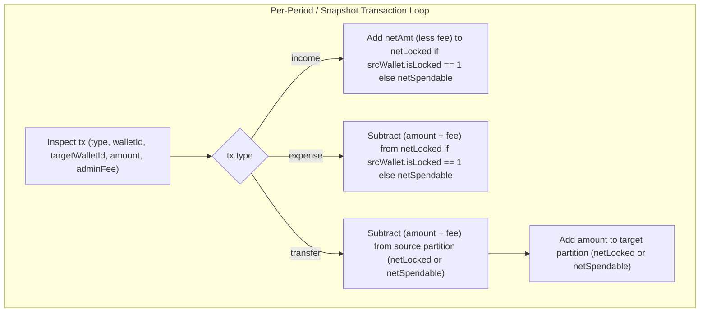

## Context

See `proposal.md` — Why for problem background and motivation.

Currently:
1. **`src/services/horizon.ts` (`getHorizonProjections`)**: Tracks `periodIncome` and `periodExpense` per period (`lines 192-226`) and computes `net = periodIncome - periodExpense`. When a `transfer` transaction occurs (`tx.type === "transfer"`), `runningBalances` are updated for both `tx.walletId` and `tx.targetWalletId`, and `tx.adminFee` is added to `periodExpense`, but the transfer principal between a spendable wallet (`walletIsLocked = 0`) and a locked wallet (`walletIsLocked = 1`) is not reflected in `cashflow`.
2. **`src/services/account-snapshot.ts` (`getAccountDetail`)**: Computes `totalIncome`, `totalExpense`, and `netSavings = totalIncome - totalExpense` in `monthlyCashFlow` (`lines 281-308, 560-563`) without partitioning spendable vs locked net cashflow.
3. **`src/services/summary.ts` (`financialSummary`)**: Computes `totalIncome`, `totalExpense`, `totalAdminFees`, and `netSavings = totalIncome - totalExpense` (`lines 189-231, 487-490`) without partitioning spendable vs locked net cashflow.

## Goals / Non-Goals

**Goals:**
- Add `netSpendable` and `netLocked` (`camelCase` numbers rounded to 2 decimal places) to `periods[].cashflow` in `getHorizonProjections` (`src/services/horizon.ts`).
- Add `netSpendable` and `netLocked` to `monthlyCashFlow` in `getAccountDetail` (`src/services/account-snapshot.ts`).
- Add `netSpendable` and `netLocked` to the returned summary object in `financialSummary` (`src/services/summary.ts`).
- Guarantee the accounting conservation invariant $\text{netSpendable} + \text{netLocked} = \text{net}$ (or $\text{netSavings}$) for single-currency portfolios and exact consistency with period-over-period `netWorth.spendable` / `netWorth.locked` deltas in `getHorizonProjections`.

**Non-Goals:**
- Changing how `income`, `expense`, `net`, or `netSavings` are calculated.
- Introducing new query parameters or database schema changes.

## Decisions

### Decision 1: Per-Transaction Liquidity Partition Accumulators (`netSpendable`, `netLocked`)
- **Choice**:
  - In **`src/services/horizon.ts`**: Initialize `let periodNetSpendable = 0` and `let periodNetLocked = 0` alongside `periodIncome` and `periodExpense`. For each transaction `tx` in `periodTxs`:
    * `srcWallet = walletsById.get(tx.walletId)`, `srcIsLocked = srcWallet ? Number(srcWallet.walletIsLocked) === 1 : false`.
    * `income`: `convertedIncome` is added to `periodNetLocked` if `srcIsLocked`, else `periodNetSpendable`.
    * `expense`: `convertedExpense` is subtracted from `periodNetLocked` if `srcIsLocked`, else `periodNetSpendable`.
    * `transfer` (with `tx.targetWalletId`):
      - `tgtWallet = walletsById.get(tx.targetWalletId)`, `tgtCurrency = tgtWallet ? tgtWallet.walletCurrency : srcCurrency`, `tgtIsLocked = tgtWallet ? Number(tgtWallet.walletIsLocked) === 1 : false`.
      - `convertedDebit = convertCurrency(totalDebit, srcCurrency, cleanBaseCurrency, fxRates.rates)` is subtracted from `periodNetLocked` if `srcIsLocked`, else `periodNetSpendable`.
      - `convertedCredit = convertCurrency(tx.amount, tgtCurrency, cleanBaseCurrency, fxRates.rates)` is added to `periodNetLocked` if `tgtIsLocked`, else `periodNetSpendable`.
  - In **`src/services/account-snapshot.ts`** and **`src/services/summary.ts`**: Construct `walletsById` before the transaction loop and apply the same per-wallet lock-status accumulation across non-opening `income`, `expense`, and `transfer` transactions.
- **Rationale**:
  - Directly mirrors the `runningBalances` mutations already executed in `horizon.ts`, guaranteeing that `netWorth.spendable[P] - netWorth.spendable[P-1] == cashflow.netSpendable[P]` and `netWorth.locked[P] - netWorth.locked[P-1] == cashflow.netLocked[P]`.
  - Requires zero additional SQL queries or FX fetches because `walletsById` and `fxRates` are already in memory.
- **Alternatives Considered**:
  - *Computing `netSpendable` as `periodSpendable - prevPeriodSpendable`*: In `horizon.ts`, both per-transaction accumulation and balance-delta yield the exact same result; tracking per-transaction in the loop also works identically in `account-snapshot.ts` and `summary.ts` where opening balances (`Initial balance:`) are excluded from cashflow.

### Schema, State, Security & Edge Compliance
- **Zero Remote Deletion Invariant**: Strictly additive read-path calculation. Zero DDL migrations, zero `DELETE`/`DROP`/`TRUNCATE` statements, and zero remote database mutations.
- **Schema & Data Modeling**: No changes to `src/db/schema.ts` or `drizzle/` migrations.
- **State & Concurrency**: Atomic wallet balance updates (`sql\`wallet_balance + ${delta}\``) remain untouched.
- **Security & Multi-Tenancy**: All queries retain mandatory `eq(schema.wallets.walletUserId, userId)` and `eq(schema.transactions.transactionUserId, userId)` RLS filters.
- **Edge Compatibility**: Pure TypeScript arithmetic inside V8 isolate (`workerd`).

## Risks / Trade-offs

- `[Unlinked or deleted targetWalletId on legacy transfer rows] -> Mitigation`: Guard `if (tx.targetWalletId)` and default `tgtIsLocked = false` if `walletsById.get(tx.targetWalletId)` is absent, matching existing `runningBalances` transfer handling.
