## Context

See `proposal.md` — Why for problem background and motivation.

Currently:
1. **`src/services/horizon.ts` (`getHorizonProjections`)**: Iterates `for (const g of goals)` inside each period simulation (`line 272`), computes `goalCurrent` in `g.goalCurrency` by summing linked wallets' projected `runningBalances` (or `g.goalCurrentAmount` if unlinked), and pushes into `periodGoals` without sorting.
2. **`src/services/account-snapshot.ts` (`getAccountDetail`)**: Maps `goalsData` into `goals` (`line 401`) without sorting by accumulated capital (`currentAmount`).
3. **`src/services/summary.ts` (`financialSummary`)**: Maps `goalsData` into `activeGoals` (`line 297`) without sorting by `currentAmount`.
4. **`src/services/goal.ts` (`listGoals`)**: Queries `schema.goals` ordered by `desc(schema.goals.goalCreatedAt)` and attaches derived progress sequentially via `attachDerivedProgress` (`line 43`), leaving derived goals ordered by creation timestamp rather than evaluated `goalCurrentAmount`.

## Goals / Non-Goals

**Goals:**
- Enforce deterministic descending `currentAmount` ordering (`converted` in `baseCurrency` DESC, then raw `currentAmount` DESC, then `goalId` ASC) on `periods[].goals[]` in `getHorizonProjections` (`src/services/horizon.ts`).
- Enforce identical deterministic descending `currentAmount` ordering on `goals[]` in `getAccountDetail` (`src/services/account-snapshot.ts`) and `activeGoals[]` in `financialSummary` (`src/services/summary.ts`).
- Enforce deterministic descending `goalCurrentAmount` ordering (`b.goalCurrentAmount - a.goalCurrentAmount || a.goalId.localeCompare(b.goalId)`) in `listGoals` (`src/services/goal.ts`), and sort `linkedWallets` / `linkedWalletsBreakdown` by `convertedAmount` descending.
- Preserve 100% of existing JSON response property names and types without extra FX requests or database queries.

**Non-Goals:**
- Introducing new query parameters (`orderBy`, `direction`) on `/api/v1/goals` or analytics endpoints.
- Changing the wire format of `PeriodProjection["goals"][number]` or `AccountDetailResult["goals"][number]`.
- Modifying database tables, indexes, or migrations.

## Decisions

### Decision 1: Per-Period In-Memory Sort by Converted `baseCurrency` `currentAmount` in `getHorizonProjections`
- **Choice**: Within the per-period loop in `src/services/horizon.ts`, pair each constructed goal projection item with its `convertedCurrent = convertCurrency(goalCurrent, g.goalCurrency || cleanBaseCurrency, cleanBaseCurrency, fxRates.rates)`, sort the entries by:
  1. `b.converted - a.converted` (descending value in `cleanBaseCurrency`)
  2. `b.item.currentAmount - a.item.currentAmount` (descending raw `currentAmount` tie-breaker)
  3. `a.item.goalId.localeCompare(b.item.goalId)` (deterministic ascending UUID tie-breaker)
  and unwrap `.map((entry) => entry.item)` into `periodGoals`.
- **Rationale**:
  - Roll-forward transactions mutate linked wallet balances differently across periods; a goal with a lower starting balance in Period 1 may receive a large planned deposit into its linked wallet in Period 2 and become the highest-capital goal. Sorting inside each period loop guarantees `periods[i].goals` accurately reflects that period's projected ranking.
  - Using `fxRates.rates` (already fetched once at the top of `getHorizonProjections`) properly ranks multi-currency goals at zero additional I/O cost.
- **Alternatives Considered**:
  - *Sorting at the SQL query level (`ORDER BY goal_current_amount DESC`)*: Rejected because derived goals store `goal_current_amount = 0` in the `goals` table and derive their live/projected amount from `goal_wallets` and `runningBalances`.

### Decision 2: Converted `baseCurrency` `currentAmount` Sort in `getAccountDetail` and `financialSummary`
- **Choice**: In `src/services/account-snapshot.ts` and `src/services/summary.ts`, sort `goals` / `activeGoals` by `convertCurrency(currentAmount, currency, baseCurrency, fxRates.rates)` descending, then raw `currentAmount` descending, then `goalId` ascending. Also sort embedded `linkedWalletsBreakdown` / `linkedWallets` by `b.convertedAmount - a.convertedAmount || b.balance - a.balance || a.walletId.localeCompare(b.walletId)`.
- **Rationale**: Both services already hold `fxRates` and evaluate derived goal totals in memory. Sorting both collections with the same comparator ensures visual consistency across `/api/v1/account-detail`, `/api/v1/summary`, and `/api/v1/analytics/horizon`.

### Decision 3: Post-Derivation Sort in `listGoals` (`src/services/goal.ts`)
- **Choice**: In `listGoals` (`src/services/goal.ts`), after `attachDerivedProgress` populates the evaluated `goalCurrentAmount` for each goal, sort `withProgress` by `b.goalCurrentAmount - a.goalCurrentAmount || a.goalId.localeCompare(b.goalId)`, and sort `breakdown` inside `attachDerivedProgress` by `b.convertedAmount - a.convertedAmount || b.balance - a.balance || a.walletId.localeCompare(b.walletId)`.
- **Rationale**: Because `goalCurrentAmount` is computed dynamically in `attachDerivedProgress` for goals with linked wallets, sorting after derivation guarantees accurate ordering across both manual and derived goals without adding extra FX calls when all goals share a currency.

```mermaid
flowchart TD
  subgraph HorizonService["src/services/horizon.ts (getHorizonProjections)"]
    H1["For each period in normalizedPeriods"] --> H2["Evaluate each goal currentAmount from linked runningBalances"]
    H2 --> H3["Convert goal currentAmount to baseCurrency"]
    H3 --> H4["Sort periodGoals by converted DESC, currentAmount DESC, goalId ASC"]
  end

  subgraph SnapshotAndSummary["src/services/account-snapshot.ts & summary.ts"]
    S1["Compute derived currentAmount & pacing for active goals"] --> S2["Sort goals by converted currentAmount DESC, currentAmount DESC, goalId ASC"]
  end

  subgraph GoalService["src/services/goal.ts (listGoals)"]
    G1["Fetch tenant goals & attachDerivedProgress"] --> G2["Sort withProgress by goalCurrentAmount DESC, goalId ASC"]
  end
```

### Schema, State, Security & Edge Compliance
- **Zero Remote Deletion Invariant**: Strictly read-path in-memory ordering logic. Zero DDL migrations, zero `DELETE`/`DROP`/`TRUNCATE` statements, and zero remote database mutations.
- **Schema & Data Modeling**: No changes to `src/db/schema.ts` or `drizzle/` migrations.
- **State & Concurrency**: Goal derivation and roll-forward wallet balance math remain untouched.
- **Security & Multi-Tenancy**: Every query retains mandatory `eq(schema.goals.goalUserId, userId)` RLS filtering.
- **Edge Compatibility**: Uses standard ECMAScript `Array.prototype.sort` and `String.prototype.localeCompare`—fully compatible with Cloudflare Workers (`workerd`).

## Risks / Trade-offs

- `[Floating-point rounding in FX conversion tie-breaking] -> Mitigation`: Use `1e-6` epsilon check (`Math.abs(diff) > 1e-6`) before falling back to raw `currentAmount` DESC and `goalId` ASC.
- `[Existing tests indexing goals[0] assuming creation order] -> Mitigation`: Verify all existing goal tests in `tests/mcp.test.ts` and add dedicated tests covering single-period, multi-period roll-forward rank inversion, and multi-endpoint goal sorting.
