## Context

See `proposal.md` — Why for problem background and motivation.

Currently:
1. **`src/services/horizon.ts` (`getHorizonProjections`)**: Queries `schema.wallets` without an `ORDER BY` clause (`line 107`) and iterates `for (const w of wallets)` inside each period simulation (`line 233`), pushing items into `periodWalletBalances` in raw database scan order. Although `const converted = convertCurrency(bal, w.walletCurrency, cleanBaseCurrency, fxRates.rates)` is already computed on `line 243` to accumulate `periodLocked` and `periodSpendable`, `periodWalletBalances` is never sorted before being assigned to `periodsData`.
2. **`src/services/account-snapshot.ts` (`getAccountDetail`)**: Iterates `walletsWithTx` (`line 214`), computes `const converted = convertCurrency(bal, curr, resolvedBaseCurrency, fxRates.rates)` (`line 222`), and pushes items into `lockedItems` and `spendableItems` without sorting.
3. **`src/services/wallet.ts` (`listWallets`) & `src/mcp.ts` (`reedrich://wallets/list`)**: Queries `schema.wallets` filtered by `walletUserId` (and optional `walletIsLocked`) without `.orderBy(...)`, exposing PostgreSQL MVCC heap tuple ordering shifts whenever `UPDATE wallets SET wallet_balance = ...` executes.

## Goals / Non-Goals

**Goals:**
- Enforce deterministic descending balance ordering (`converted` in `baseCurrency` DESC, then `balance` DESC, then `walletId` ASC) on `periods[].walletBalances[]` in `getHorizonProjections` (`src/services/horizon.ts`).
- Enforce identical deterministic descending balance ordering on `wallets.spendable.items[]` and `wallets.locked.items[]` in `getAccountDetail` (`src/services/account-snapshot.ts`).
- Enforce SQL-level `.orderBy(desc(schema.wallets.walletBalance), asc(schema.wallets.walletId))` in `listWallets` (`src/services/wallet.ts`) and MCP resource `reedrich://wallets/list` (`src/mcp.ts`).
- Preserve 100% of existing JSON response property names and types without extra FX requests or database queries.

**Non-Goals:**
- Introducing new query parameters (`orderBy`, `direction`) on `/api/v1/analytics/horizon`, `/api/v1/account-detail`, or `/api/v1/wallets`.
- Changing the wire format of `PeriodProjection["walletBalances"][number]` or `WalletSnapshotItem`.
- Modifying database tables, indexes, or migrations.

## Decisions

### Decision 1: Per-Period In-Memory Sort by Converted `baseCurrency` Balance in `getHorizonProjections`
- **Choice**: Within the per-period loop in `src/services/horizon.ts`, pair each constructed wallet projection entry with its already-computed `converted` value (in `cleanBaseCurrency`), sort the entries by:
  1. `b.converted - a.converted` (descending value in `baseCurrency`)
  2. `b.item.balance - a.item.balance` (descending raw balance tie-breaker)
  3. `a.item.walletId.localeCompare(b.item.walletId)` (deterministic ascending UUID tie-breaker)
  and unwrap `.map((entry) => entry.item)` into `periodWalletBalances`.
- **Rationale**:
  - Roll-forward transactions mutate `runningBalances` differently across periods; a wallet with a lower starting balance in Period 1 may receive a large planned income or transfer in Period 2 and become the highest-balance wallet. Sorting inside each period loop guarantees `periods[i].walletBalances` accurately reflects that period's projected ranking.
  - Using `converted` (which is already calculated on `line 243` for `periodLocked` / `periodSpendable`) properly ranks multi-currency wallets (e.g., `$500 USD` vs `Rp 1,000,000 IDR`) at zero additional CPU or FX cost, while behaving identically to raw `balance` sorting for single-currency portfolios.
- **Alternatives Considered**:
  - *Sorting only once at the SQL query level (`ORDER BY wallet_balance DESC`)*: Rejected for `horizon` because raw SQL `wallet_balance` neither accounts for multi-currency FX conversion nor reflects period-by-period roll-forward balance changes.
  - *Exposing `convertedBalance` in the response payload*: Rejected to keep the `HorizonBoard` OpenAPI schema strictly backward-compatible.

### Decision 2: Converted `baseCurrency` Balance Sort in `getAccountDetail`
- **Choice**: In `src/services/account-snapshot.ts`, sort `spendableItems` and `lockedItems` using the already-computed `converted` valuation in `resolvedBaseCurrency` descending, followed by raw `balance` descending and `walletId` ascending.
- **Rationale**: `getAccountDetail` already fetches `fxRates` and computes `converted` for every wallet (`line 222`). Sorting both partitions with the same comparator ensures visual consistency between the Dashboard Snapshot (`GET /api/v1/account-detail`) and the Horizon Board (`GET /api/v1/analytics/horizon`).
- **Alternatives Considered**:
  - *Relying only on `listWallets` SQL order*: Rejected because `listWallets` orders by raw `wallet_balance` without FX conversion, whereas `getAccountDetail` explicitly operates in `resolvedBaseCurrency`.

### Decision 3: SQL-Level `ORDER BY wallet_balance DESC, wallet_id ASC` in `listWallets` and `reedrich://wallets/list`
- **Choice**: Add `.orderBy(desc(schema.wallets.walletBalance), asc(schema.wallets.walletId))` to the Drizzle query in `listWallets` (`src/services/wallet.ts`) and the `reedrich://wallets/list` resource handler (`src/mcp.ts`). When `wantsSnapshot` is active in `listWallets`, sort the mapped result by `b.snapshot!.totalBalance - a.snapshot!.totalBalance || b.walletBalance - a.walletBalance || a.walletId.localeCompare(b.walletId)`.
- **Rationale**: `listWallets` does not accept a `baseCurrency` parameter and does not call the external FX API. Ordering directly in PostgreSQL via Drizzle `desc(schema.wallets.walletBalance), asc(schema.wallets.walletId)` eliminates PostgreSQL MVCC tuple-order drift with zero network overhead.

```mermaid
flowchart TD
  subgraph HorizonService["src/services/horizon.ts (getHorizonProjections)"]
    H1["Fetch tenant wallets, goals, transactions, fxRates"] --> H2["Compute P0 initial balances"]
    H2 --> H3["For each period in normalizedPeriods"]
    H3 --> H4["Apply period transactions to runningBalances"]
    H4 --> H5["Build periodWalletBalances + compute converted in baseCurrency"]
    H5 --> H6["Sort by converted DESC, balance DESC, walletId ASC"]
  end

  subgraph SnapshotService["src/services/account-snapshot.ts (getAccountDetail)"]
    S1["Partition wallets into spendableItems and lockedItems with converted"] --> S2["Sort both arrays by converted DESC, balance DESC, walletId ASC"]
  end

  subgraph WalletService["src/services/wallet.ts (listWallets)"]
    W1["SELECT FROM wallets WHERE wallet_user_id = userId ORDER BY wallet_balance DESC, wallet_id ASC"]
  end
```

### Schema, State, Security & Edge Compliance
- **Zero Remote Deletion Invariant**: This change is strictly read-path ordering logic. Zero DDL migrations, zero `DELETE`/`DROP`/`TRUNCATE` statements, and zero remote database mutations are performed.
- **Schema & Data Modeling**: No changes to `src/db/schema.ts` or `drizzle/` migrations.
- **State & Concurrency**: Balance reconciliation (`sql\`wallet_balance + ${delta}\``) and horizon `runningBalances` map accumulation remain untouched. Sorting operates on transient per-request projection arrays.
- **Security & Multi-Tenancy**: Every query retains mandatory `eq(schema.wallets.walletUserId, userId)` RLS filtering.
- **Edge Compatibility**: Uses only standard ECMAScript `Array.prototype.sort`, `String.prototype.localeCompare`, and Drizzle ORM `desc`/`asc` helpers—fully compatible with Cloudflare Workers (`workerd`).

## Risks / Trade-offs

- `[Floating-point rounding in FX conversion tie-breaking] -> Mitigation`: Round `converted` comparison or fall back cleanly to raw `balance` DESC and `walletId` ASC when `converted` values are equal (`Math.abs(b.converted - a.converted) > 1e-9 ? b.converted - a.converted : ...`).
- `[Existing tests asserting hardcoded wallet array index without considering balance order] -> Mitigation`: Audit all tests in `tests/mcp.test.ts` that index into `wallets[0]` or `walletBalances[0]` and add dedicated tests verifying descending balance order across single-currency, multi-currency, and multi-period roll-forward scenarios.
